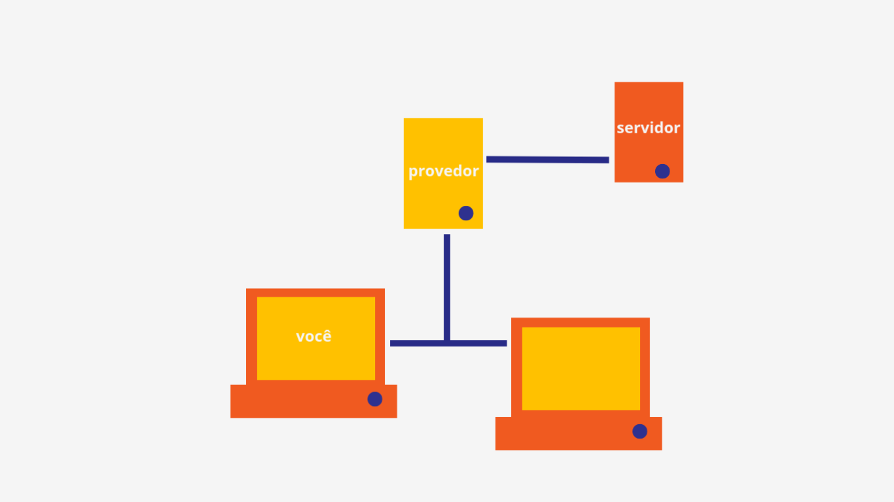
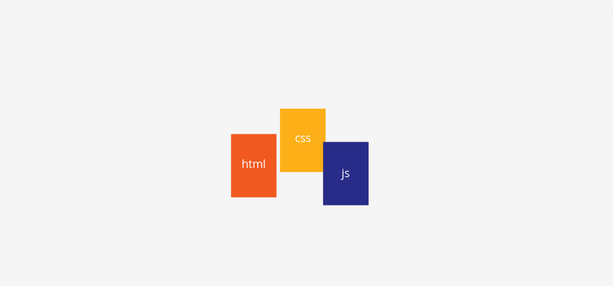

# Como nos comunicamos através da internet

> "Aprender sem pensar é trabalho perdido." Confúcio

Quando dois ou mais computadores estão conectados à internet, eles podem conversar uns com os outros.

O conteúdo de um site é organizado dentro de um conjunto especial de regras que os computadores entendem; Funciona como falar em uma linguagem secreta, codificada.

Podemos usar o Github Pages para que nossas páginas fiquem disponíveis e possam ser acessadas de qualquer computador; isso é possível porque nossas páginas ficam armazenadas nos servidores do Github. Toda vez que pedimos ao navegador para acessar nossa página, o servidor do Github nos envia rapidamente uma cópia dos arquivos dessa página para que ela possa ser interpretada através do navegador.

Explicando de forma mais clara, o navegador pede os arquivos que contém os códigos do site - que estão armazenados no servidor - através do endereço. O servidor, então, envia os arquivos de volta para que o navegador possa interpretar seu código e exibir a página na tela.

Um servidor é um computador especial que contém arquivos de páginas da web. Seu computador em casa ou na escola não é um servidor, porque ele não está conectado diretamente à [internet](https://super.abril.com.br/historia/tim-berners-lee/). Nós nos conectamos à internet através de um provedor de serviços de internet.

Por isso, um site que você escreve no seu computador não pode ser visto por outras pessoas em um computador diferente até que você o hospede em um servidor.

## Como páginas da web são construídas

No final dos anos 80 um físico chamado Tim Berners-Lee, começou a idealizar como cientistas poderiam compartilhar documentos através da rede.

Em 1990 Tim sugeriu um padrão para construção de documentos com hipertextos e logo nasceu a Linguagem de Marcação de Hipertexto, a HTML, que evoluiu muito até chegar na versão atual.

Você pode imaginar um site como um grande livro, em que páginas e mais páginas são ligadas umas às outras, e, no decorrer dos capítulos, podemos colocar atalhos para outras páginas. Diferentemente do exemplo do livro, não precisamos folhear um site, já que tudo está ao alcance de um clique. Assim como o conteúdo de um livro, nossos sites contém textos, mas eles são organizados através de elementos em HTML, que vamos aprender e que os nossos navegadores já conhecem muito bem.

### HTML estrutura páginas

A HTML é a linguagem base de uma página da web. É ela quem determina a estrutura das nossas páginas, que podem conter textos, imagens, vídeos, e dar vida a tantos sites fantásticos que conhecemos hoje. Um documento em HTML é composto por uma estrutura formada de TAGS, que são marcações para identificar os diversos tipos de conteúdos e ainda organizá-los de forma semântica.

### CSS estiliza

Até então, as páginas já tinham uma estrutura e podiam ser acessadas, mas as pessoas começaram a pensar em como torná-las mais amigáveis e estéticamente harmôniosas e isso era muito difícil de se fazer somente com HTML. Algum tempo depois, em 1996, nasceu a Folha de Estilos em Cascata, a CSS, que veio para deixar as nossas páginas literalmente cheias de estilo!

### JS cria interações

Tudo continuou evoluindo maravilhosamente rápido e, algum tempo depois, foi criada a linguagem Javascript, que tem variadas funções, como validar valores de um formulário para garantir que são aceitáveis antes de serem enviados ao servidor, por exemplo, e atividades bem mais complexas que vamos ver mais adiante no curso.

