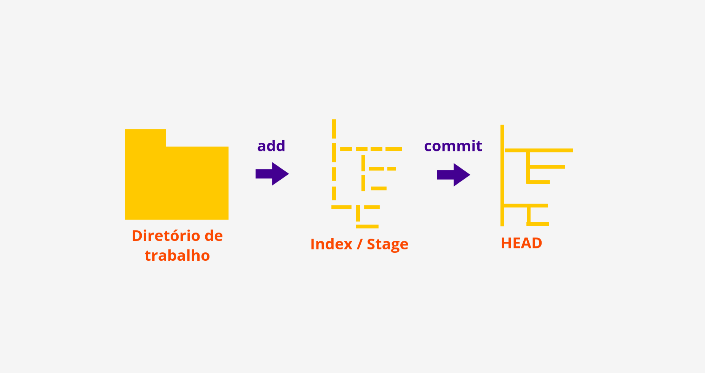

# Começando com Git

## Introdução

Vamos colocar nossa primeira página online, e para isso vamos usar Git, o Github e seu serviço Github Pages como nossa ferramenta. Mas antes, precisamos compreender o que são cada uma dessas ferramentas e como elas funcionam.

### Primeiros comandos

O Git é um sistema de controle de versão e gerenciamento de código fonte desenvolvido por Linus Torvalds, criado inicialmente para o desenvolvimento do Kernel Linux.

Podemos pensar no Git como um fotógrafo de nossas alterações. Ele fica registrando as mudanças feitas em um ou mais arquivos ao longo do tempo. Mas como ele faz isso? Bom... Vamos aprender na prática como isso acontece!

Antes de tudo, precisamos inicializar o Git em nosso projeto. Isso precisa ser feito apenas uma vez no projeto. Precisamos fazer esse passo uma vez por projeto. Navegue até a pasta que você quer começar a rastrear, tenha certeza de que você está dentro da pasta certa e digite o comando:

```text
git init
```

### Entendendo o fluxo de trabalho



* Quando você modifica seus arquivos, você está fazendo isso em seu **diretório de trabalho**.
* Depois você pode selecionar quais arquivos deseja lançar nesta nova versão, adicionando eles em sua **área de preparação**, ou index/stage
* Por último, a partir das mudanças armazenadas na área de preparação você pode salvar permanentemente esse momento na história do projeto criando um **commit**

### Criando commits

Ainda pensando no git como um fotógrafo de nossas alterações, precisamos dizer a ele quais fotografias queremos que ele nos lembre. É como salvar o momento de um jogo no videogame e poder voltar nele ou só lembrar dele depois.

Antes de tudo, você pode revisar as modificações que foram feitas. Para ver quais arquivos foram alterados, podemos usar uma instrução para que o git nos informe quais são. Precisamos checar o status do nosso **diretório de trabalho** Usamos o seguinte comando:

```text
git status
```

Para visualizar exatamente quais mudanças são essas usamos o seguinte comando:

```text
git diff
```

Agora já sabemos quais arquivos foram alterados! Supondo que esse é mesmo o momento da história do nosso repositório que queremos guardar na **área de preparação**, usamos agora o seguinte comando para guardar as alterações de um arquivo:

```text
git add nomedoarquivo
```

Se você fez mudanças em mais de um arquivo, e não quiser digitar esse comando para cada um deles, você pode ~~~~usar \* ou . ao invés de especificar os nomes deles. Exemplo:

```text
git add *
```

Agora podemos criar um **commit** para gravar esse momento atual da área de preparação na história do repositório. Cada momento deve ter uma descrição sobre ele também. Para isso usamos o comando:

```text
git commit -m "oi! eu sou o seu primeiro commit!"
```

### Desfazendo mudanças

Uma das vantagens em poder guardar esses momentos, digo, commits é que se a gente precisar é possível desfazer as mudanças que fizemos e então o repositório fica igual ao ultimo commit que criamos. Para isso, ao invés de usar o git add, usamos o git checkout:

```text
git checkout nomedoarquivo
```

Se você já tiver usado o git add, isso significa que ele já está na área de seleção já esperando pelo próximo commit, se você fez isso, precisa tirar ele de lá. Para isso você pode usar o comando:

```text
git reset HEAD nomedoarquivo
```

Agora é só usar o git checkout novamente, e prontinho, alterações desfeitas!

### Aprendendo novos comandos

Existem vários outros comandos que podemos aprender, você pode ver uma lista com a descrição de mais alguns usando o comando help:

```text
git help
```

### Referências

* [Página oficial da plataforma](https://git-scm.com/)
* [Git Handbook by GitHub](https://guides.github.com/introduction/git-handbook/)
* [Folha de consultas do Git by Github](https://github.github.com/training-kit/downloads/pt_BR/github-git-cheat-sheet/)
* [Wikipedia](https://pt.wikipedia.org/wiki/Git)
* [Visualizando Git](http://git-school.github.io/visualizing-git/)
* [Git handbook by Github](https://guides.github.com/introduction/git-handbook/)

