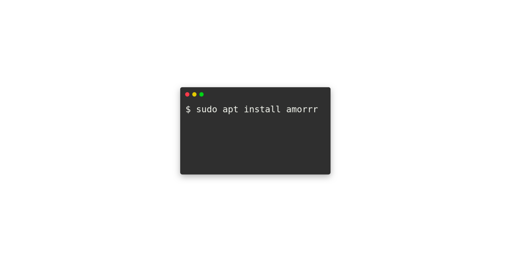

# Conhecendo a linha de comando

### Introdução

Vamos conhecer finalmente a famosa telinha preta que vemos os hackers usando nos filmes e séries. Algo que o cinema não mostra, é que elas são bem simples, e podem ser usadas para diversas coisas, como criar um novo arquivo, e até mesmo colocar um site ou aplicação online.



Essa famosa tela preta, que é chamada de **linha de comando**, cmd, prompt, console, terminal... ufa! ou interface de linha de comando, é um aplicativo baseado em texto para visualização, manipulação e manuseio de arquivos em seu computador.

Dominar alguns comandos dessa tela pode ajudar muito em nossa jornada na programação, e é por isso que vamos começar a aprende-los!

Para aproveitar melhor essa e outras aulas, é recomendado que você escreva os comandos ao invés de copia-los, dessa forma você vai lembrar deles depois.

### Primeiros comandos

Vamos aprender alguns comandos, eles mudam um pouco de sistema operacional para sistema operacional. Durante essa aula vamos focar nos comandos do Linux. Isso porque nos computadores dos polos onde o VnW acontece escolhemos usar esse sistema.

Mas se você usa Windows em casa pode pesquisar os comandos equivalentes, ou se preferir, você pode instalar o [Git Bash](https://git-scm.com/) mas nem todos os comandos podem funcionar.

Para começar, abra o terminal digite o seguinte comando:

```text
whoami
```

O computador acabou de apresentar seu nome de usuário! Legal, não é?

Seria legal saber em que pasta estamos agora. É recomendável que você sempre saiba essa informação! Se você não souber, é só usar o comando. Digite o seguinte comando e aperte o enter:

```text
pwd
```

Se preferir, você pode também se localizar vendo quais arquivos estão dentro da pasta. Você pode descobrir isso usando o comando para listar arquivos:

```text
ls
```

### Navegando entre pastas

Uma coisa bem legal que você pode fazer agora é aprender a navegar entre pastas! Eu não tenho certeza de quais pastas você tem aí em seu computador, então vamos criar uma nova chamada teste. Digite o seguinte comando:

```text
mkdir teste
```

Para ter certeza de que a pasta foi criada você pode usar o ls novamente.

```text
ls
```

Se a pasta foi criada, agora você pode entrar dentro dela usando o seguinte comando:

```text
cd teste
```

Legal! Você conseguiu entrar dentro dela. E se quisermos também criar um novo arquivo em nossa pasta nova? Vamos criar um chamado texto.txt usando o comando touch:

```text
touch texto.txt
```

Que tal agora voltar? Você pode fazer isso usando o comando:

```text
cd ..
```

### Mais alguns comandos

Há muitos comandos úteis, que podem fazer muitas coisas, como desligar o computador, criar arquivos, remover arquivos, e mais um monte de outras coisas. Há alguns bem básicos que podem nos ajudar muito em nossas tarefas enquanto desenvolvedor. Vamos conhecer alguns:

`whoami`: Mostra o nome do usuário  
`man`: Usado para mostrar o manual de um outro comando  
`sudo`: Deve ser usado com cuidado. Ele dá permissões de administrador  
`ls`: Lista os arquivos do diretório  
`pwd`: Mostra o diretório atual  
`cd`: Usado para mudar de diretório  
`cp`: Copia um arquivo ou diretório  
`mv`: Usado para mover um arquivo ou renomeá-lo  
`mkdir`: Cria uma nova pasta  
`touch`: Cria um novo arquivo  
`more`: Lê um arquivo de texto  
`grep`: Lê e faz uma busca por palavras dentro de um arquivo  
`clear`: Limpa a tela  
`exit`: Fecha o terminal

### Referências

[Help ubuntu](https://help.ubuntu.com/kubuntu/desktopguide/pt_BR/terminals.html)  
[Intro to command line](https://tutorial.djangogirls.org/pt/intro_to_command_line/)

