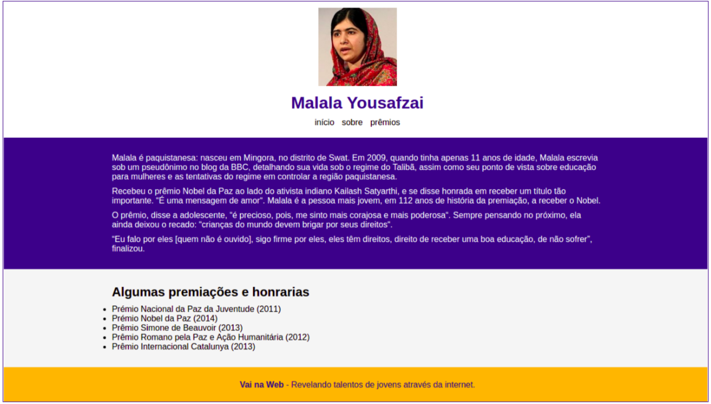
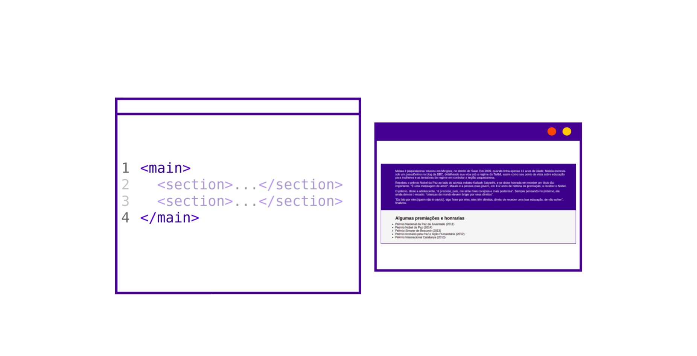

# Páginas semânticas

### Introdução

Há elementos no HTML que conhecemos como elementos de caixa, ou containers, que podem ser usados para agrupar elementos. Houve uma época em que construíamos essas caixas simplesmente com uma tag chamada `
`, e ainda usamos ela eventualmente para caixas que não carregam um sentido.

Com a chegada do HTML5, ganhamos algumas tags com significado semântico, e passamos a usar não somente `div`. Isso foi muito importante para os navegadores e usuários, consequentemente isso facilitou também a nossa vida enquanto desenvolvedor.

### Organizando conteúdo de forma semântica

`<section>` Define uma seção

`<nav>` Define um menu com links de navegação

  
`<header>` Define o cabeçalho de uma página ou seção.

  
`<footer>` Define o rodapé de uma página ou seção.

  
`<main>` Define o conteúdo principal ou importante no documento. Deve existir apenas um  
`<article>` Pode definir um artigo, um comentário enviado pelo usuário etc  
`<aside>` Define um conteúdo reservado dentro página.

Na dúvida sobre qual elemento de caixa usar, você deve pensar sobre qual o sentido ou significado dessa caixa em sua página. Exemplo: uma caixa que representa um menu, deve ser definida por um nav. Uma caixa que não representa nenhum sentido, mas precisa ser usada mesmo assim, deveria ser uma div.

