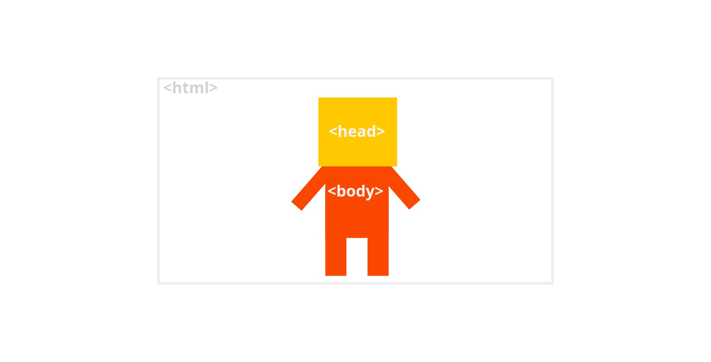

# Primeiras marcações

### Introdução

Para estruturar páginas a linguagem HTML usa um conjunto predefinido de regras para identificar os diversos tipos de conteúdos. Usamos as Tags para criar marcações que dizem aos navegadores quais elementos estão presentes na página e como devem ser interpretados.

### Primeiras marcações

Uma tag precisa começar com o sinal de menor &lt; e terminar com o sinal de maior &gt;. Exemplo:

```markup
<p>
```

Embora algumas tags especiais sejam fechadas por padrão, a maior parte delas não é. Logo, ao criar uma tag para abrir uma marcação precisamos também adicionar uma para fecha-la. Para criar uma tag de fechamento, usamos um sinal de barra / depois do sinal de maior. 

Exemplo:

```markup
<p>Olá, eu sou um parágrafo.</p>
```

As tags devem dizer exatamente o que é o conteúdo entre sua tag de abertura e fechamento. Devemos marcar com as tags quais partes do conteúdo são parágrafos, títulos, listas, etc, chamamos isso de Semântica.

### Estrutura básica

Há algumas tags principais que compõem uma página padrão. Toda página na web tem uma tag html, head e body. A tag `html` indica elementos em html, dentro dela temos `<head>`, que significa cabeça, e `<body>`, que significa corpo.



Fazendo uma analogia ao corpo humano, na cabeça temos as coisas que não vemos, coisas que pensamos e que são importantes para nosso funcionamento. Mas as coisas do nosso corpo são as partes de nós que podem ser vistas. Assim é no HTML, as coisas que ficam na `head` são importantes, mas não são exibidas no navegador quando a página é carregada.  A parte que queremos exibir e o nosso conteúdo que deve ficar na `body`.

Um exemplo de elemento importante mas não precisa ser visto diretamente na página é o `title`. Veremos outros no decorrer deste módulo.

```markup
<html>
    <head>
        <title>Título</title>
    </head>
    <body>
        <p>Olá mundo!</p>
    </body>
</html>
```

Há vários elementos diferentes, continue conhecendo mais alguns!

### Elementos aninhados

Nossa estrutura HTML contém vários elementos diferentes e alguns elementos até estão dentro de outros elementos, como se guardássemos uma caixa dentro de outra caixa e dentro dela colocássemos outra caixa, e outra caixa... Confuso, não é?

Imaginar a cena das caixas já pode ter sido confuso para muita gente, assim como para o navegador diante de elementos dispostos dessa forma. Para que isso não aconteça, nós aninhamos nossos elementos, ou seja, usamos esses espaçamentos nas linhas para indicar que um elemento está dentro de outro. Exemplo:

```markup
<section>
    <p>Olá, eu sou um parágrafo.</p> 
</section>
```

### Criando títulos

Existem seis níveis diferentes de títulos para usar em uma imagem. O título `H1` é o mais importante,`h6` é o menos importante. 

Exemplo:

```markup
<h1>Eu sou o título mais importante!</h1>
<h2>Eu sou um pouco menos importante</h2>
<h3>Eu sou um pouco menos importante</h3>
<h4>Eu sou um pouco menos importante</h4>
<h5>Eu sou um pouco menos importante</h5>
<h6>Eu sou o menos importante</h6>
```

### Referências

* [Fundamentos do texto em HTML - Mozilla](https://developer.mozilla.org/pt-BR/docs/Aprender/HTML/Introducao_ao_HTML/Fundamentos_textuais_HTML)
* [MarketSheet.io](https://marksheet.io/)
* [O que está na head? - Mozilla](https://developer.mozilla.org/pt-BR/docs/Aprender/HTML/Introducao_ao_HTML/The_head_metadata_in_HTML)
* [HTML Atributes - Mozilla](https://developer.mozilla.org/en-US/docs/Web/HTML/Attributes)
* [HTML Elements - Mozilla](https://developer.mozilla.org/pt-BR/docs/Web/HTML)

